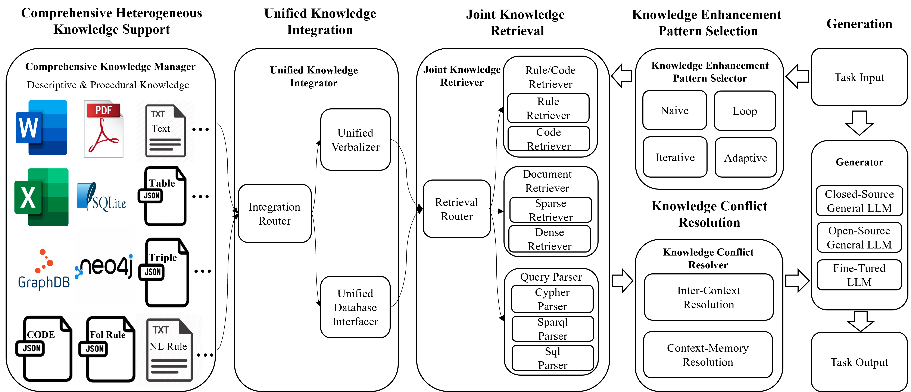
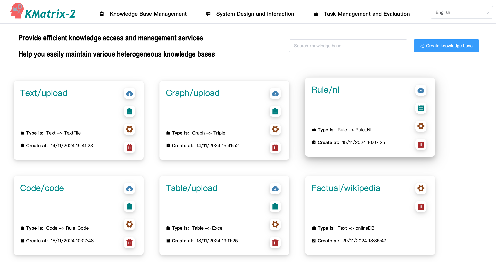
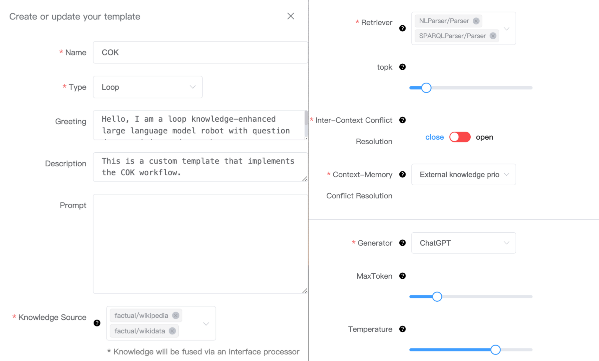
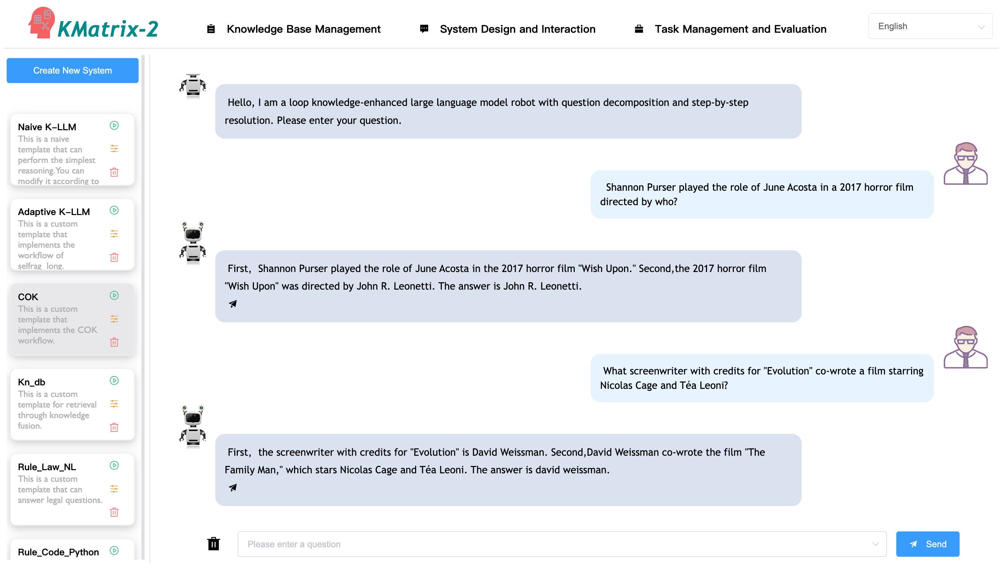
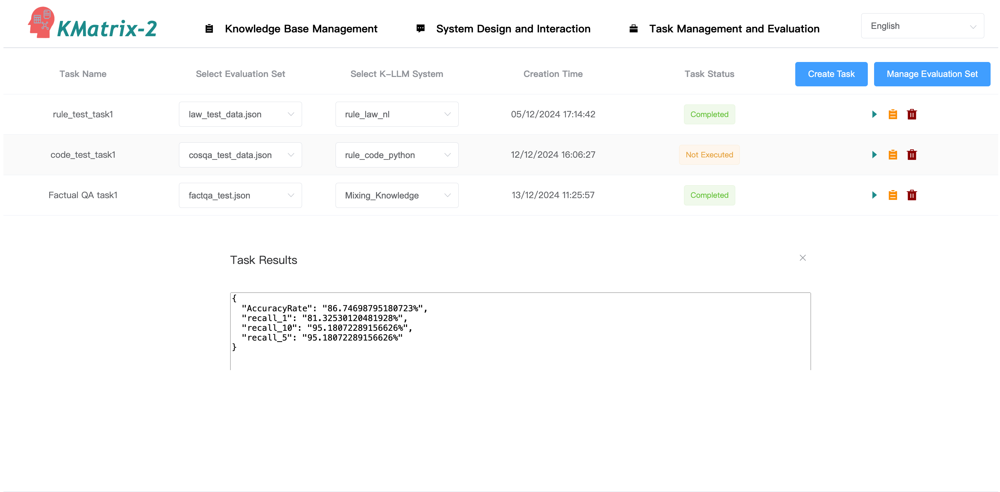

#  :sunflower: KMatrix-2: A Comprehensive Heterogeneous Knowledge Collaborative Enhancement Toolkit for Large Language Model


  


We present KMatrix-2, an open-source toolkit that supports comprehensive heterogeneous knowledge collaborative enhancement for LLMs, our main contributions are:


1. The paper proposes a comprehensive heterogeneous knowledge collaborative enhancement toolkit (KMatrix-2) for LLMs. Compared with previous toolkits, which mainly focused on descriptive knowledge, KMatrix-2 specifically considers the enhancement on procedural knowledge.

2. KMatrix-2 offers a rich selection of modular components and several typical enhancement patterns to support convenient construction of mainstream heterogeneous K-LLMs systems.

3. KMatrix-2 integrates systematic knowledge conflict resolution solutions for better knowledge integration, including inter-context and context-memory conflict resolution.

4. We provide comparative performance results of heterogeneous knowledge access and collaborative enhancement to demonstrate the capabilities of KMatrix-2.

   




## :wrench: Quick Start

### 1. Quick Start from Manual

**Installation** 

To get started with KMatrix2, simply clone it from Github and install (requires Python 3.7+ ,  Python 3.10 recommended): 


    $ git clone https://github.com/NLPerWS/KMatrix-2
    
    # It is recommended to use a virtual environment for installation
    $ conda create -n KMatrix2 python=3.10
    $ conda activate KMatrix2
    
    # Install backend environment
    $ cd KMatrix-2
    $ pip install -r requirements.txt
    
    # Install Frontend environment
    # You need a node environment, and nvm is recommended for node environment management
    # Recommended node environments: 16.20.2
    # You can refer to the fellowing websites to install nvm
    # https://nvm.uihtm.com/#nvm-linux 
    # https://github.com/nvm-sh/nvm
    # After installing the node environment, execute:
    $ cd font_kmatrix2
    $ npm install


    # Additional model
    You need to visit these two websites to download the text2natsql_schema_item_classifier and text2natsql-t5-base models.
    
    https://drive.google.com/file/d/1UWNj1ZADfKa1G5I4gBYCJeEQO6piMg4G/view
    https://drive.google.com/file/d/1QyfSfHHrxfIM5X9gKUYNr_0ZRVvb1suV/view
    
    These two models are used to convert text into SQL statements (you can skip this if you don't need this feature). 
    Once the download is complete, please place the model files into the dir_model/ directory.
    
    # Additional datasets and knowledges
    We have uploaded all the datasets and knowledge bases used in the experiment, 
    You can run the following command to download:
    $ git lfs install
    $ git clone https://www.modelscope.cn/datasets/zhangyujie/KMatrix2_Rep.git
    And then upload to the system as needed for use.

**StartUp**


    If you have successfully installed the environment, a quick start will be easy.
    
    1. Set the baseURL in font_kmatrix2/src/axios/index.js to the IP address of deployment server.
    2. Start the toolkit by executing following command: 
    $ cd KMatrix-2/font_kmatrix2
    $ npm run dev
    $ cd KMatrix-2
    $ python flask_server.py
    Visit KMatrix2 toolkit using the browser: http://yourserverip:10021


###  2. Quick Start from Docker (recommended)

``` 
$ git clone https://github.com/NLPerWS/KMatrix-2.git
$ chmod +x -R KMatrix-2
Set configurations that needs to be modified in the root_config.py
Set the baseURL in font_kmatrix2/src/axios/index.js to the IP address of deployment server.

$ docker pull leap233/kmatrix2:v1
$ cd KMatrix-2
$ sh docker_start.sh	
```

## :dizzy: Toolkit Usage

KMatrix-2 is an open-source toolkit that supports comprehensive heterogeneous knowledge collaborative enhancement for Large Language Models(K-LLMs). We inherit the main framework of KMatrix, but place it in the background to hide K-LLMs design details. A rich of modular components (like Retrievers, Generators, Conflict Resolver, etc) and several typical enhancement patterns (such as loop and adaptive patterns) are encapsulated, and can be combined to conveniently construct mainstream heterogeneous K-LLMs systems. 

Our toolkit consists of three sections: Knowledge Base Management, System Design and Interaction, and Task Management and Evaluation. ***The screencast video of our toolkit are available at [here](https://youtu.be/E7hk-jrM2CY)***, which introduces the detailed instructions for using KMatrix-2.
<video width="85%" height="500" controls>
  <source src="images/kmatrix2_v2.mp4" type="video/mp4">
</video>

### Knowledge Base Management 

   Knowledge Base Management provides efficient heterogeneous descriptive and procedural knowledge access and management services, and the interface of Knowledge Base Management is shown in the picture below. 




We can easily create descriptive and procedural knowledge bases, including Text, Table, Knowledge Graph, Rule and Code. And upload corresponding knowledge files (like PDF, WORD, Rule JSON, etc.) or databases (like SQLite, Neo4j, GraphDB, etc). All knowledge bases we create will be uniformly managed, and users can easily search and modify the information in the knowledge bases.

### System Design and Interaction 

   System Design and Interaction supports the construction, deployment, and user interaction of the K-LLMs system. The interface of System Construction is shown in picture.
   We offer a rich selection of modular components and several typical enhancement patterns to support convenient construction of mainstream heterogeneous K-LLMs systems. We can construct K-LLMs system by: 

   1) Selecting knowledge enhancement pattern, including: Naive, Loop, Adaptive and Iterative;
   2) Selecting knowledge source;
   3) Selecting retriever and configuring parameters;
   4) Selecting knowledge conflict resolution strategy;
   5) Selecting generator and configuring parameters.

   KMatrix-2 automatically matches the corresponding Knowledge Integrator (Unified Verbalizer and Unified Querier) based on the selected knowledge bases, without the need for manual selection by users.





   After that, we can deploy the K-LLMs system and interact with it. The interface of System(Loop K-LLMs) Deployment and Interaction is shown in the picture below. 



### Task Management and Evaluation 

   Task Management and Evaluation is used for constructing, managing and executing evaluation tasks for the K-LLMs system, and the interface of Task Management and Evaluation is shown in the picture below. Users can:

   1) Construct evaluation task: create evaluation task, select evaluation dataset & K-LLMs system.
   2) Executing evaluation task: After constructing evaluation task, we can run the evaluation task, and the evaluation results will be presented.
   3) Managing evaluation task: View the evaluation task execution progress, abort or delete the evaluation task.




##  :notebook: Knowledge And Datasets

**Heterogeneous descriptive and procedural knowledge used in KMatrix-2 evaluation**:

You can find our knowledge base here: **https://www.modelscope.cn/datasets/zhangyujie/KMatrix2_Rep/files**  (Folder is: knowledges/)

|    Knowledge Type     |    Knowledge Name    | Knowledge Scale |
| :-------------------: | :------------------: | :-------------: |
| Descriptive Knowledge |      Wikipedia       |     21000k      |
|                       |       Wikidata       |      5790k      |
|                       |      Wikitable       |      6860k      |
| Procedural Knowledge  | NL Rule (RuleBench)  |      2462       |
|                       | FOL Rule (RuleBench) |      2065       |


**Evaluation datasets selectd by KMatrix-2**:  

You can find our datasets here: **https://www.modelscope.cn/datasets/zhangyujie/KMatrix2_Rep/files**  (Folder is: datasets/)

|  Dataset Type  | Dataset Name | Dataset Scale |
| :------------: | :----------: | :-----------: |
| Code Retrieval |     COIR     |    223358     |
| Rule Retrieval |  RuleBench   |     4527      |
|   Factual QA   |   2Wikiqa    |     12576     |
|                |   Hotpotqa   |     7405      |
|                |      NQ      |     3610      |
|                |    Popqa     |     1399      |
|                |   Triviaqa   |     7313      |
|                |    Webqa     |     2032      |
| Inferential QA |  RuleBench   |     4527      |


## :page_facing_up: Experimental Results	

**Knowledge access performance evaluation**

**(a) Rule knowledge retrieval performance evaluation (Recall@10)**

|                    | Clutrr | Deer |  Law   | Ulogic | TheoremQA | Clutrr-Fol | Ulogic-Fol | Law-Fol |
| :----------------: | ------ | :--: | :----: | ------ | --------- | ---------- | ---------- | ------- |
|        BM25        | 2.67%  | 100% | 70.48% | 86.51% | 44.55%    | 3.82%      | 37.71%     | 58.43%  |
|         E5         | 9.54%  | 100% | 19.88% | 70.72% | 38.00%    | 10.97%     | 45.30%     | 13.86%  |
|        BGE         | 4.77%  | 100% | 97.59% | 95.06% | 67.45%    | 4.96%      | 90.72%     | 92.77%  |
| Self-Induction+BGE | 15.08% | 100% | 98.19% | 98.67% | 80.36%    | 13.55%     | 98.80%     | 97.59%  |

**(b) Code knowledge retrieval performance evaluation (Recall@10)**

|                    | Codetrans-Dl | Stackoverflow | Apps   | Codefeedback | Codetrans-Contest | Text2sql | Cosqa  |
| ------------------ | ------------ | ------------- | ------ | ------------ | ----------------- | -------- | ------ |
| BM25               | 80.15%       | 56.96%        | 6.89%  | 55.06%       | 53.77%            | 56.89%   | 31.11% |
| E5                 | 44.44%       | 93.63%        | 16.92% | 52.29%       | 76.02%            | 86.60%   | 57.80% |
| BGE                | 71.11%       | 71.21%        | 10.84% | 43.69%       | 60.18%            | 82.79%   | 41.20% |
| Self-Induction+BGE | 56.86%       | 87.98%        | 46.10% | 49.63%       | 70.63%            | 91.76%   | 39.66% |

**(c) Semantic parsing performance of Query Parser (EM)**

| Sparql Parser Evaluation |        | Sql Parser Evaluation |        |
| :----------------------: | :----: | :-------------------: | :----: |
|          Model           |   EM   |         Model         |   EM   |
|          WikiSP          | 75.55% |    RESDSQL(t5-3b)     | 72.64% |


**Descriptive & procedural knowledge enhancement performance evaluation**

**(a) Descriptive & procedural knowledge enhancement performance evaluation on Factual QA tasks (Acc)**

|       Knowledge        | Popqa  | Webqa  |   NQ   | Triviaqa | Hotpotqa | 2Wikiqa |
| :--------------------: | :----: | :----: | :----: | :------: | :------: | :-----: |
|        Without         | 23.45% | 29.53% | 13.24% |  42.86%  |  16.65%  | 23.75%  |
|      Declarative       | 62.26% | 37.60% | 36.62% |  61.70%  |  27.90%  | 26.45%  |
| Declarative+Procedural | 62.54% | 36.96% | 35.84% |  60.74%  |  27.20%  | 26.35%  |

**(b) Descriptive & procedural knowledge enhancement performance evaluation on Inferential QA tasks (Acc)**

|       Knowledge        | Clutrr |  Deer  |  Law   | Ulogic | TheoremQA | Clutrr-Fol | Ulogic-Fol | Law-Fol |
| :--------------------: | :----: | :----: | :----: | :----: | :-------: | :--------: | :--------: | :-----: |
|        Without         | 25.19% | 85.71% | 27.71% | 11.81% |  53.27%   |   24.81%   |   11.81%   | 27.11%  |
|      Declarative       | 27.96% | 95.24% | 22.89% | 48.80% |  33.82%   |   28.34%   |   48.55%   | 23.49%  |
| Declarative+Procedural | 31.97% | 95.24% | 40.96% | 58.43% |  29.27%   |   32.06%   |   58.55%   | 40.96%  |


**Knowledge conflict resolution evaluation**

|                        |     Method     |  Acc   |
| :--------------------: | :------------: | :----: |
| CM Conflict Resolution | w/o knowledge  | 14.69% |
|                        |  w/ knowledge  | 28.59% |
|                        |    +COIECD     | 66.44% |
| IC Conflict Resolution | w/o knowledge  | 0.01%  |
|                        |  w/ knowledge  | 42.70% |
|                        | +Discriminator | 50.00% |


## 🔖 License

Apache 2.0 License.
